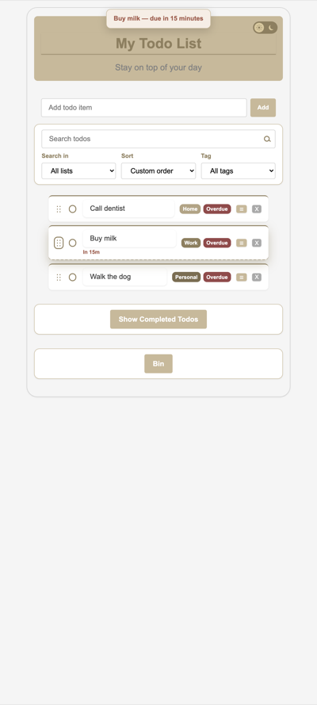
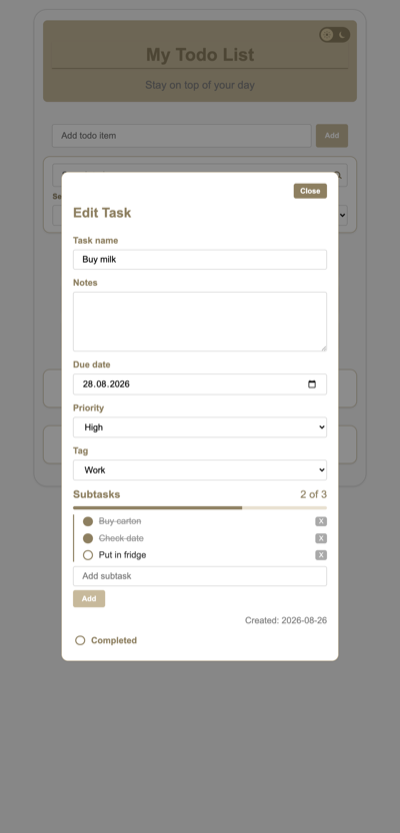
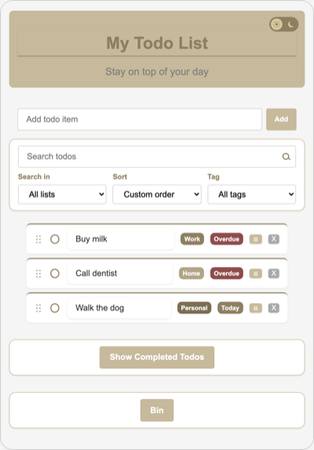
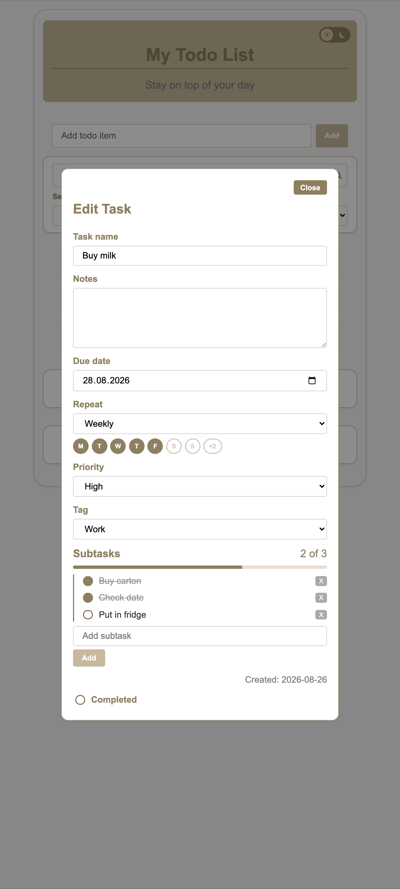
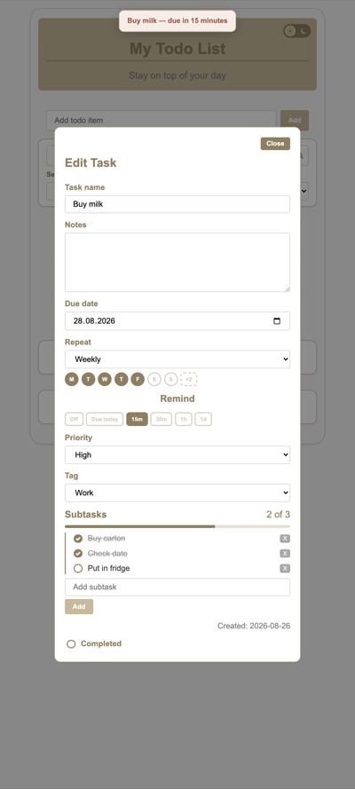

# Todo App

<p align="center">
  <strong>A browser todo list — HTML, CSS, and vanilla JavaScript.</strong><br>
  No frameworks. No backend. Your list stays in <code>localStorage</code>.
</p>

<p align="center">
  <a href="https://todo-app-brown-six-47.vercel.app/">
    
  </a>
</p>

<p align="center">
  <a href="https://todo-app-brown-six-47.vercel.app/"></a>
  
  <a href="LICENSE"></a>
</p>

<p align="center">
  <a href="https://todo-app-brown-six-47.vercel.app/"><strong>Open the live app</strong></a>
  &nbsp;·&nbsp; Ivan Ivanov
  &nbsp;·&nbsp; <a href="LICENSE">MIT</a>
</p>

<p align="center">
  
  
  
</p>

---

## Features

<table>
<tr>
<td valign="top" width="50%">

**Lists**
- Add from the form
- Check to complete, uncheck to restore
- Completing a normal task collapses the row, then it moves to Completed (repeating tasks stay Active)
- Empty-state messages
- Saved across refresh in the browser
- **Show Completed Todos** and **Bin** toggles (pure CSS)

**Bin**
- **X** moves one task to the Bin
- **Move all to Bin** for every completed task
- Restore one, restore all, or delete forever
- Empty bin with an in-app confirm (Cancel or Empty bin)

</td>
<td valign="top" width="50%">

**Editor (☰)**
- Name, notes, due date, repeat, remind, priority, tag, subtasks, created date, completed
- Double-click a name to rename (Enter / click away to save, Escape to cancel)
- Subtasks: count (`2 of 3`), progress bar, olive rail; Enter adds; circle shows a tick
- Repeat: None, Daily, Weekly (Mon–Fri), Weekend, Fortnight (**×2**), Monthly, Custom
- Remind: Off, Due today, 15m, 30m, 1h, 1d (toast while the tab is open)

**Toolbar**
- Search by name (hidden, not deleted) with a glass / **×**
- **Search in:** All / Active / Completed / Bin
- Sort: date added, due, priority, or **Custom order**
- Tag filter: All / Work / Home / Personal

</td>
</tr>
<tr>
<td valign="top">

**On the row**
- Due chips: **Overdue**, **Today**, **Tomorrow**
- Tag chips: **Work**, **Home**, **Personal**
- Repeat **Last done** and remind caption on one line (`In 15m • Last done 31 Aug`)

</td>
<td valign="top">

**Reorder & look**
- Drag the 6-dot grip (sets Custom order)
- Keyboard: Tab to the grip, **Space**, **↑ / ↓**, **Space** (Escape cancels). Bin has no grip
- Light / Dark sun–moon pill
- Circular checkboxes, gold/tan cards, hover styles, accessible labels

</td>
</tr>
</table>

---

## How to use

| Step | What to do |
| :---: | --- |
| 1 | Type a task and click **Add** (or press Enter) |
| 2 | Search as you type. **Search in** picks All / Active / Completed / Bin. **×** clears the box |
| 3 | Sort by date added, due, priority, or Custom order. **Tag** filters Work / Home / Personal |
| 4 | Drag the 6 dots, or Tab → **Space** → arrows → **Space**. Check the circle to complete. **Move all to Bin** clears Completed |
| 5 | Double-click to rename, or **☰** for the full editor. Close or click the backdrop to save |
| 6 | **X** sends one task to the Bin |
| 7 | Open **Bin** to restore, restore all, delete forever, or empty |
| 8 | Click the sun / moon switch for Light / Dark |

Each visitor’s list is stored only in their own browser.

---

## Run locally

Open `index.html` in a browser, or use Live Server. No install step.

```
todo-app/
├── index.html
├── README.md
├── LICENSE
├── .gitignore
└── assets/
    ├── css/style.css
    ├── js/script.js
    └── screenshots/
```

---

## Version gallery

Screenshots of the real HTML and CSS at each **main** release live in a closed section below. Bugfix tags (v1.3.1, v1.7.1, v1.7.2, v1.8.1, v1.8.2, v1.9.1, v1.12.1) are skipped. Same sample todos in every shot.

<details>
<summary><strong>Show version screenshots</strong></summary>

<br>

<table>
<tr>
<td align="center" valign="top" width="33%">
<strong>v1.0.0</strong><br>First public<br>

</td>
<td align="center" valign="top" width="33%">
<strong>v1.1.0</strong><br>Bin<br>

</td>
<td align="center" valign="top" width="33%">
<strong>v1.2.0</strong><br>Dark mode<br>

</td>
</tr>
<tr>
<td align="center" valign="top">
<strong>v1.3.0</strong><br>Task editor<br>

</td>
<td align="center" valign="top">
<strong>v1.4.0</strong><br>Search<br>

</td>
<td align="center" valign="top">
<strong>v1.5.0</strong><br>Move all to Bin<br>

</td>
</tr>
<tr>
<td align="center" valign="top">
<strong>v1.6.0</strong><br>Sort<br>

</td>
<td align="center" valign="top">
<strong>v1.7.0</strong><br>Search scope<br>

</td>
<td align="center" valign="top">
<strong>v1.8.0</strong><br>Due hints<br>

</td>
</tr>
<tr>
<td align="center" valign="top">
<strong>v1.9.0</strong><br>Tags<br>

</td>
<td align="center" valign="top">
<strong>v1.10.0</strong><br>Subtasks<br>

</td>
<td align="center" valign="top">
<strong>v1.11.0</strong><br>Drag<br>

</td>
</tr>
<tr>
<td align="center" valign="top">
<strong>v1.12.0</strong><br>Recurring<br>

</td>
<td align="center" valign="top">
<strong>v1.13.0</strong><br>Reminders<br>

</td>
<td align="center" valign="top">
<strong>v1.14.0</strong><br>Keyboard reorder<br>

</td>
</tr>
</table>

</details>

<details>
<summary><strong>Build history</strong></summary>

<br>

The app was built in phases — structure and styling first, then behavior, then persistence and a public release.

| Phase | Focus | Status |
|-------|--------|--------|
| **Phase 1** | HTML structure, semantic markup, accessibility basics | Done |
| **Phase 2** | CSS styling, layout, completed toggle, custom checkboxes | Done |
| **Phase 3** | JavaScript — add, delete, complete, move todos | Done |
| **Phase 4** | Persist todos, empty states, and inline edit | Done |
| **Phase 5** | GitHub Pages deploy and README for v1.0.0 | Done |
| **Phase 6** | Bin — restore, restore all, empty, delete forever | Done |
| **Phase 7** | Dark mode with saved theme | Done |
| **Phase 8** | Task editor overlay — notes, due date, priority, created date | Done |
| **Phase 9** | Search / filter by todo name | Done |
| **Phase 10** | Move all completed todos to the Bin | Done |
| **Phase 11** | Sort by date added, due date, or priority | Done |
| **Phase 12** | Search scope — All / Active / Completed / Bin | Done |
| **v1.7.1** | Search toolbar card — Search, Search in, and Sort grouped | Done |
| **v1.7.2** | Add text box hover — gold border only, no bronze fill | Done |
| **Phase 13** | Due-soon hint on the row — Overdue / Today / Tomorrow | Done |
| **v1.8.1** | Theme switch — sun / moon pill instead of the Dark / Light chip | Done |
| **v1.8.2** | Even sun rays (SVG) and Safari press hop fix | Done |
| **Phase 14** | Tags / color — Work, Home, Personal, and a filter by tag | Done |
| **v1.9.1** | Search glass on the right, and a matching **×** to clear | Done |
| **Phase 15** | Subtasks in the editor — count, progress bar, left rail | Done |
| **Phase 16** | Drag to reorder — left grip, custom order | Done |
| **Phase 17** | Recurring tasks — Repeat in ☰, weekday circles, Last done | Done |
| **v1.12.1** | Custom order restore, collapse on complete, editor polish | Done |
| **Phase 18** | Reminders — pills in ☰, row caption, toast | Done |
| **Phase 19** | Keyboard reorder — Space to pick up, arrows to move | Done |

</details>

---

## License

MIT — see [LICENSE](LICENSE).
