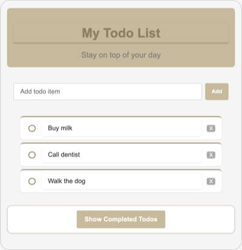
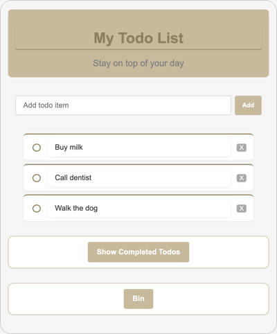
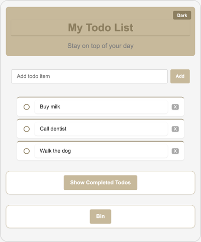
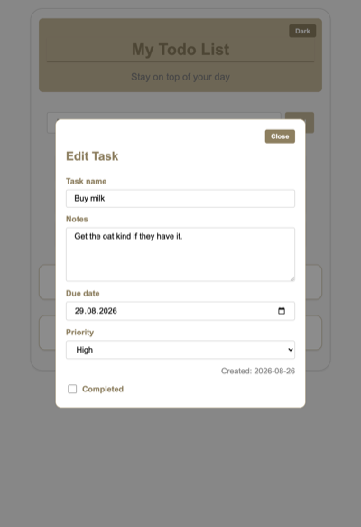
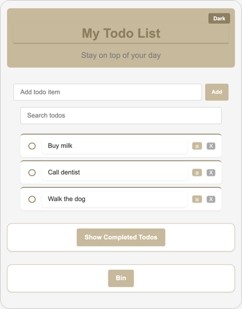
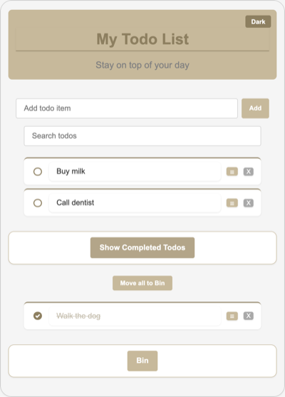
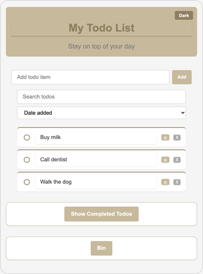
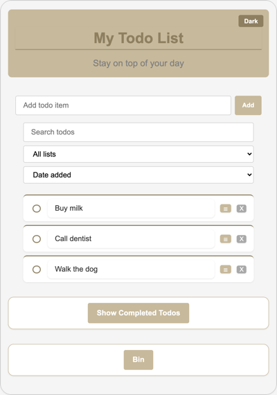
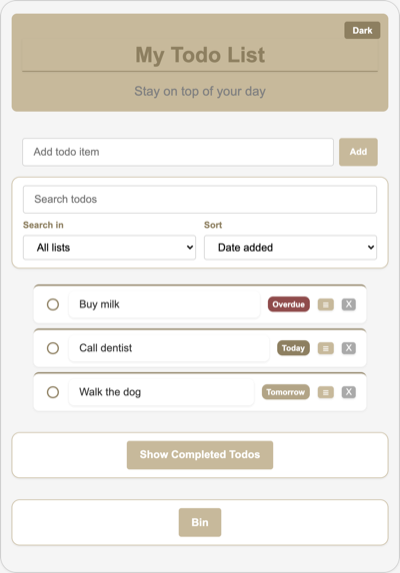
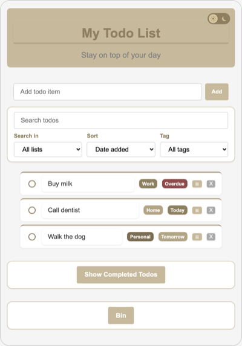

# Todo App

A browser todo list built with HTML, CSS, and vanilla JavaScript. No frameworks, build tools, or backend — todos are saved in the browser with `localStorage`.

**Live demo:** [https://ivanitd.github.io/todo-app/](https://ivanitd.github.io/todo-app/)  
**Version:** 1.9.0  
**Author:** Ivan Ivanov  
**License:** [MIT](LICENSE)

## Features

- Add todos from the form
- Move a todo to the **Bin** with the **X** button
- **Move all to Bin** sends every completed todo to the Bin at once
- Restore one binned task, restore all, or delete one forever
- Empty the bin with an in-app confirm (Cancel or Empty bin)
- Check an item to move it to the completed list
- Uncheck a completed item to move it back
- Double-click todo text to edit (Enter or click away to save, Escape to cancel)
- **☰** opens a task editor overlay (name, notes, due date, priority, tag, created date, completed)
- Due-soon chips on the row: **Overdue**, **Today**, **Tomorrow** (set the date in ☰; later dates stay quiet)
- Tag chips on the row: **Work**, **Home**, **Personal** (set in ☰; None hides the chip)
- Search, **Search in**, Sort, and **Tag** sit in one toolbar card (`#todo-tools`)
- Search box filters todos by name (hidden, not deleted)
- **Search in** limits search to All lists, Active, Completed, or Bin — and opens Completed or Bin when you search there
- **Tag** filter shows All tags, or only Work, Home, or Personal (works with search)
- Sort dropdown reorders active and completed lists by date added, due date, or priority
- Empty-state messages when a list has no items
- Todos persist across page refreshes
- Light / Dark theme switch in the header (sun and moon on a sliding pill; saved in the browser)
- **Show Completed Todos** and **Bin** toggles (pure CSS)
- Hover styles on Add, Bin, Restore All, Empty bin, Move all to Bin, and the theme toggle in both themes
- Custom circular checkboxes on the list and in the task editor, gold/tan card layout
- Accessible labels on form controls

## How to use

1. Type a task and click **Add** (or press Enter).
2. Use **Search todos** to show only names that match. Use **Search in** for **All lists**, **Active**, **Completed**, or **Bin**. Searching Completed or Bin (or All, when those lists have a match) opens that section. Clear the box to see the full list again.
3. Use the sort menu for **Date added**, **Due date**, or **Priority** (set due date and priority in **☰**). Use **Tag** to show All tags, or only Work, Home, or Personal.
4. Check the circle to complete it. Turn on **Show Completed Todos** to see that list. **Move all to Bin** sends every completed item to the Bin.
5. Double-click the text to rename a task, or click **☰** for the full editor (notes, due date, priority, tag, and more). Close or click the dim backdrop to save. **Overdue**, **Today**, or **Tomorrow** appears on the row when the due date needs attention. **Work**, **Home**, or **Personal** appears when a tag is set.
6. Click **X** to move one task to the **Bin**.
7. Open **Bin** to restore a task, restore all, delete one forever, or empty the bin.
8. Click the sun / moon switch in the header to change theme.

Each visitor’s list is stored only in their own browser.

## How to run locally

Open `index.html` in a browser, or use Live Server in your editor. No install step.

## Version gallery

Screenshots of the real HTML and CSS at each **main** release live in a closed section below. Bugfix tags (v1.3.1, v1.7.1, v1.7.2, v1.8.1, v1.8.2) are skipped. Same sample todos in every shot.

<details>
<summary><strong>Show version screenshots</strong></summary>

<br>

<table>
<tr>
<td align="center" valign="top" width="33%">
<strong>v1.0.0</strong><br>First public<br>

</td>
<td align="center" valign="top" width="33%">
<strong>v1.1.0</strong><br>Bin<br>

</td>
<td align="center" valign="top" width="33%">
<strong>v1.2.0</strong><br>Dark mode<br>

</td>
</tr>
<tr>
<td align="center" valign="top">
<strong>v1.3.0</strong><br>Task editor<br>

</td>
<td align="center" valign="top">
<strong>v1.4.0</strong><br>Search<br>

</td>
<td align="center" valign="top">
<strong>v1.5.0</strong><br>Move all to Bin<br>

</td>
</tr>
<tr>
<td align="center" valign="top">
<strong>v1.6.0</strong><br>Sort<br>

</td>
<td align="center" valign="top">
<strong>v1.7.0</strong><br>Search scope<br>

</td>
<td align="center" valign="top">
<strong>v1.8.0</strong><br>Due hints<br>

</td>
</tr>
<tr>
<td align="center" valign="top">
<strong>v1.9.0</strong><br>Tags<br>

</td>
</tr>
</table>

</details>

## Tech Stack

- HTML5
- CSS3 (Flexbox, custom checkboxes, `:has()` selector)
- Vanilla JavaScript (DOM events, `localStorage`)

## Project Structure

```
todo-app/
├── README.md
├── LICENSE
├── .gitignore
├── index.html              # App entry point
└── assets/
    ├── css/
    │   └── style.css       # All styles
    ├── js/
    │   └── script.js       # App logic
    └── screenshots/        # Main-version gallery (README)
```

## Development Phases

The app was built in phases — structure and styling first, then behavior, then persistence and a public release.

| Phase | Focus | Status |
|-------|--------|--------|
| **Phase 1** | HTML structure, semantic markup, accessibility basics | Done |
| **Phase 2** | CSS styling, layout, completed toggle, custom checkboxes | Done |
| **Phase 3** | JavaScript — add, delete, complete, move todos | Done |
| **Phase 4** | Persist todos, empty states, and inline edit | Done |
| **Phase 5** | GitHub Pages deploy and README for v1.0.0 | Done |
| **Phase 6** | Bin — restore, restore all, empty, delete forever | Done |
| **Phase 7** | Dark mode with saved theme | Done |
| **Phase 8** | Task editor overlay — notes, due date, priority, created date | Done |
| **Phase 9** | Search / filter by todo name | Done |
| **Phase 10** | Move all completed todos to the Bin | Done |
| **Phase 11** | Sort by date added, due date, or priority | Done |
| **Phase 12** | Search scope — All / Active / Completed / Bin | Done |
| **v1.7.1** | Search toolbar card — Search, Search in, and Sort grouped | Done |
| **v1.7.2** | Add text box hover — gold border only, no bronze fill | Done |
| **Phase 13** | Due-soon hint on the row — Overdue / Today / Tomorrow | Done |
| **v1.8.1** | Theme switch — sun / moon pill instead of the Dark / Light chip | Done |
| **v1.8.2** | Even sun rays (SVG) and Safari press hop fix | Done |
| **Phase 14** | Tags / color — Work, Home, Personal, and a filter by tag | Done |

## How the Completed Toggle Works

The **Show Completed Todos** control uses a hidden checkbox and a styled label as a button. When checked, CSS reveals the completed list:

```css
#completed-todo-container-checkbox:has(#completed-todo-checkbox:checked) ~ #completed-todo-list-container {
    display: block;
}
```

The toggle card and completed list are separate blocks under `<main>` — the list appears below the button, not inside the same card.

**Move all to Bin** (`#completed-bin-all`) lives inside `#completed-todo-list-container`, not inside the `<ul>`, so it is not saved as a todo. A click runs `moveToBin` on every completed row (same helper as **X**).

## How the Task Editor Works

There is **one** overlay for the whole page (`#task-editor`), not a copy inside each todo. Clicking **☰** fills that panel from the chosen row and removes the `hidden` attribute. Close (or the backdrop) writes the fields back onto that row, then saves.

The overlay uses `hidden` to hide. CSS only applies `display: flex` when the attribute is off (`#task-editor:not([hidden])`), so `display` does not override `hidden`.

The **Completed** checkbox in the overlay uses the same circular style as the list (`appearance: none`, `border-radius: 50%`). Dark-theme button hovers are extra rules (`[data-theme="dark"] …:hover`) so they are not overwritten by the dark resting colors.

## How Search Works

`#todo-search` is **outside** the add form so Enter does not create a todo. Search, **Search in**, Sort, and **Tag** live in one `#todo-tools` card. `#todo-search-in` sits under the search box, also outside the form. Option values: `all`, `active`, `completed`, `bin` (must match JS).

On each keystroke, `filterTodos` compares the query to each row’s name (case-insensitive) and sets `li.hidden` on non-matches. Changing **Search in** runs the same function (`change`, not `input`). Clearing the box shows every row again. Search does not change `localStorage`.

- **All lists** — search active, completed, and Bin. If the query matches a completed or binned name, that section opens.
- **Active** — search the main list only
- **Completed** / **Bin** — search that list only, and check the section toggle so it is visible

List rows use `display: flex`. That would override `hidden` the same way the overlay did, so flex is applied only with `#todo-list li:not([hidden])` (and the same for the completed list and `#bin-list li:not([hidden])`).

## How Sort Works

`#todo-sort` sits in `#todo-tools-row` next to **Search in** and **Tag**, outside the add form. It reorders the **active** and **completed** lists only (not the Bin). There is no extra `localStorage` key — it reads `createdAt`, `dueDate`, and `priority` already stored on each row.

- **Date added** — oldest `createdAt` first  
- **Due date** — earliest due first; todos with no date go last  
- **Priority** — High, then Medium, then Low, then None  

`sortTodos` runs on dropdown `change` and inside `updateEmptyMessages` (before `filterTodos`), so add, restore, and editor saves keep the current sort. `list.append(li)` moves existing rows; it does not copy them.

## How Due Hints Work

Each active/completed row has a `.todo-due-hint` span (created in `createTodoItem`, not in `index.html`). Bin rows do not. `applyTodoDetails` calls `setDueHint`, which compares `dueDate` to `todayDate()` and `tomorrowDate()`. No extra `localStorage` key — it reads the due date already saved on the row.

- **Overdue** — date is before today (`#8f4b4b`)
- **Today** — date is today (`#8d7f60`)
- **Tomorrow** — date is tomorrow (`#b2a486`, a lighter Today gold — not button tan `#c7b99b`)
- No date, or a later date — the hint stays `hidden`

`#todo-list li span` would style the hint like the name box, so `.todo-due-hint` comes after that rule and wins.

## How Tags Work

Each task has one fixed tag: **None**, **Work**, **Home**, or **Personal**. Set it in ☰ (`#task-editor-tag`). Filter from `#todo-tag-filter` in the tools row (`all`, `work`, `home`, `personal`). There is no extra `localStorage` key — `tag` is stored on each todo next to `priority`.

Active and completed rows get a `.todo-tag` chip (created in `createTodoItem`, not in `index.html`). Bin rows do not. `applyTodoDetails` calls `setTagChip`. None hides the chip. Colors: Work `#8d7f60`, Home `#b2a486`, Personal `#7a6d52`. `.todo-tag` is grouped with `.todo-due-hint` so it is not styled like the name box.

Search and Tag both have to match. When **Search in** skips a list, Tag still applies (`showAllRows`). Double-click skips the chip and the due hint so those labels are not renamed.

## How the Theme Switch Works

`#theme-toggle` is a `div` with `role="button"` in the header (same `id`, same click, same `todoTheme` key). Inside it: a sun, a sliding knob, and a moon. The sun is an SVG — eight copies of one bar, rotated around the center — so the rays stay even. CSS slides the knob when `<html>` has `data-theme="dark"`. Do not set `themeToggle.textContent` — that would wipe the inner markup. Dark track is charcoal `#2b2b2b`, not cream, so the pill does not vanish into the olive header. Do not put `#theme-toggle` on the brown `#8d7f60` button group. The pill uses whole-pixel sizes so Safari does not hop the sun on press. Enter and Space still toggle the theme.

## How Persistence Works

After add, delete, complete, edit, bin, or closing the task editor, the app saves:

- `todos` — active and completed items as `{ text, isDone, notes, dueDate, priority, tag, createdAt }`
- `binnedTodos` — bin items with the same shape (`isDone` remembers whether to restore to active or completed)
- `todoTheme` — `"dark"` or `"light"`

On load, both lists and the bin are rebuilt from that data. If nothing is saved, they start empty. Todos created before v1.3.0 still load; extra fields start empty until you open and close the editor once. Todos created before v1.9.0 load with tag **None**.

## License

This project is licensed under the MIT License — see [LICENSE](LICENSE) for details.
